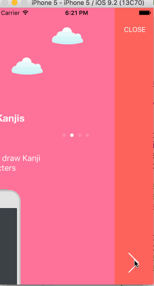

# Group project - *Japanize*

**Japanize** is a learning Japanese app.

## User Stories

The following **required** functionality is completed:

- [ ] Select difficulty and see progressive levels
- [ ] Touch based Kanji character learning. Learn through trace and keyword prompts. Focus on stroke order and legibility
- [ ] Audio record word and phrase pronunciation and compare side-by-side to Japanese speaker samples
- [ ] Widget - Reminders and word/phrase of the day

The following **optional** features are implemented:

- [ ] Create personal account to store profile and score data across devices. (Facebook, Google+, Parse?)
- [ ] Ranking and leaderboards
- [ ] On first load a tutorial to show off features and how to use the app
- [ ] Voice recognition to check pronunciation
- [ ] Word practice with random generated romanji 

## Mockups

- [Fluidui mockup](https://www.fluidui.com/editor/live/preview/p_8GcThK0sN5ULhu99CC37CaAhpnJKyPVn.1456373676042)
- [Invision storyboard](https://invis.io/MS63T87PW)
- [Initial prototype](https://codepathuniversity.slack.com/files/xinxinxie-ccsf/F0NAYEM5F/file_feb_20__9_03_17_pm.jpeg)

## API
 - [Mockup](http://docs.japanize.apiary.io/)

## Resources
- http://kanjivg.tagaini.net/
- https://github.com/mbilbille/dmak
- http://nippongrammar.appspot.com/
- https://ospalh.github.io/anki-addons/Kanji%20stroke%20color.html
- https://github.com/jgorset/Recorder
- http://tegaki.org/

## Video Walkthrough 

Here's a walkthrough of implemented user stories:



## Data schema

The data schema is documented in the API in every end-point. Basically we have:

 - Users: http://private-f1e8a-japanize.apiary-mock.com/users

```
[
  {
    "id": 1,
    "name": "Alejandro",
    "bio": "CCSF student",
    "email": "asanc142@mail.ccsf.edu",
    "score": 1000
  }
]
```

 - Kanji characters: http://private-f1e8a-japanize.apiary-mock.com/kanji

```
[
  {
    "id": 1,
    "name": "Kanji 1",
    "description": "Practice Kanji first character",
    "character": "仮",
    "score": 5
  }
]
```

 - Words: http://private-f1e8a-japanize.apiary-mock.com/words

```
[
  {
    "id": 1,
    "name": "Word 1",
    "description": "Practice Kanji first character",
    "meaning_english": "Hello",
    "meaning_hiragana": "仮",
    "meaning_romanji": "仮",
    "score": 5
  }
]
```

 - Levels: http://private-f1e8a-japanize.apiary-mock.com/levels

```
[
  {
    "level": 1,
    "published_at": "2015-08-05T08:40:51.620Z",
    "activities": [
      {
        "type": "Kanji",
        "id": 1
      }
    ]
  }
]
```
